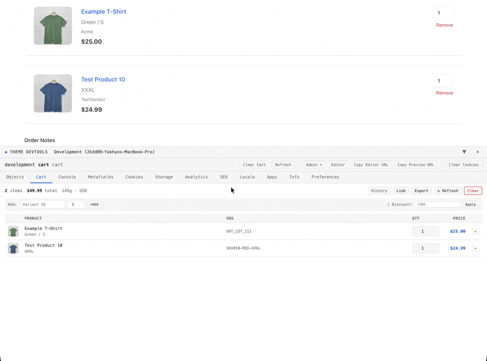

# Shopify Theme Devtools

[](https://www.npmjs.com/package/shopify-theme-devtools)
[](LICENSE)
[](https://www.jsdelivr.com/package/npm/shopify-theme-devtools)

A powerful in-browser developer tools panel for Shopify theme development. Inspect Liquid objects, evaluate expressions, explore metafields, manipulate cart state, detect Liquid errors, and much more — all without leaving the browser.

## Features

### Core Panels

- **Objects Inspector** — Browse `shop`, `product`, `collection`, `customer`, `cart` and more with deep search and collapsible tree view
- **Metafields Viewer** — Explore metafields across all resources and namespaces with type labels
- **Cart Panel** — Real-time cart state with add/remove/quantity controls, cart history with restore, and attribute editing
- **Console** — Chrome DevTools-style console with Liquid expression evaluator, autocomplete, and log filtering
- **Localization** — Markets, currencies, languages, and country data with quick switcher
- **SEO Inspector** — Meta tags, Open Graph, Twitter Cards, and structured data (JSON-LD) validation
- **Analytics Viewer** — Detects Google Analytics, Facebook Pixel, and other tracking codes
- **Storage Inspector** — Browse and edit localStorage, sessionStorage, and cookies
- **Apps Panel** — Lists installed Shopify apps detected on the page
- **Info Panel** — Theme details, template info, and request metadata

### Objects Inspector

Browse and search through all Liquid objects with a collapsible tree view. Click any key to copy its Liquid path.


### Console Panel

Evaluate Liquid expressions in real-time with autocomplete, filter support, and command history.


### Cart Snapshots

Track cart state changes over time and restore any previous snapshot with a single click.



### Console Expression Evaluator

The Console panel includes an interactive expression evaluator for testing Liquid paths:

```
> product.title
"Classic Cotton T-Shirt"

> product.variants[0].price | money
"$29.99"

> cart.items | size
3

> shop.name | upcase
"MY AWESOME STORE"
```

**Features:**
- **Autocomplete** — Suggests paths as you type with Tab completion
- **Liquid Filters** — Supports `upcase`, `downcase`, `money`, `size`, `first`, `last`, and 50+ filters
- **Array Access** — Navigate arrays with bracket notation: `product.variants[0].title`
- **Live Data** — Uses current cart and product data, not stale page load values
- **Command History** — Use arrow keys to navigate previous expressions

### Cart Panel

- **Live Updates** — Cart state updates in real-time as items are added/removed
- **Quantity Controls** — Adjust item quantities directly
- **Cart History** — View previous cart states with timestamps and restore any snapshot
- **Attribute Editor** — Modify cart attributes and notes
- **Diff View** — See what changed between cart states

### Liquid Error Detection

Automatically scans the page for common Liquid issues:

- `Liquid error:` and `Liquid syntax error:` messages
- Drop object leaks (`#<ProductDrop:0x...>`)
- Missing snippets and assets
- Schema validation errors
- Deprecation warnings

### Network Monitor

Captures failed HTTP requests with:
- Status codes and response times
- Request URLs with query parameters
- Error categorization (4xx, 5xx, CORS, timeout)

## Quick Start

### 1. Add the snippet to your theme

Copy the Liquid bridge to your theme's snippets folder:

```bash
# Option A: Download directly
curl -o snippets/theme-devtools-bridge.liquid \
  https://raw.githubusercontent.com/user/shopify-theme-devtools/main/src/liquid/theme-devtools-bridge.liquid

# Option B: Install via npm
npm install shopify-theme-devtools
cp node_modules/shopify-theme-devtools/src/liquid/theme-devtools-bridge.liquid snippets/
```

### 2. Include in your layout

Add this line to `layout/theme.liquid` just before `</body>`:

```liquid

```

### 3. You're done!

The devtools panel automatically appears on **unpublished/development themes only**. It's safe to commit — it won't render on your live published theme.

## Keyboard Shortcuts

| Action | Shortcut |
|--------|----------|
| Toggle Panel | `Cmd+Shift+D` (Mac) / `Ctrl+Shift+D` (Windows) |
| Copy Liquid Path | Click any property key in Objects panel |
| Evaluate Expression | `Enter` in Console input |
| Autocomplete | `Tab` in Console input |
| Command History | `↑` / `↓` in Console input |

## Panel Reference

| Panel | Description |
|-------|-------------|
| **Objects** | Inspect all Liquid objects with search and tree navigation |
| **Metafields** | Browse metafields by resource (product, collection, shop, etc.) |
| **Cart** | Live cart state, history snapshots, and manipulation tools |
| **Locale** | Markets, currencies, languages with locale switching |
| **Analytics** | Detected tracking codes and analytics configuration |
| **SEO** | Meta tags, Open Graph, Twitter Cards, JSON-LD structured data |
| **Apps** | Installed Shopify apps detected on the page |
| **Console** | Logs, errors, and Liquid expression evaluator |
| **Cookies** | Browser cookies with expiration and flags |
| **Storage** | localStorage and sessionStorage key-value pairs |
| **Info** | Theme info, template details, request metadata |
| **Preferences** | Panel position, theme (dark/light), font scale, shortcuts |

## Configuration

### Local Development

For local development with hot reload:

1. Edit the bridge snippet to enable local mode:

```liquid

```

2. Run the dev server:

```bash
npm run dev  # Starts at localhost:9999
```

### Metafields Schema

To show all defined metafields (not just ones with values), paste your theme's `metafields.json` content into the bridge snippet:

```liquid

{
  "product": [
    { "namespace": "custom", "key": "care_instructions", "type": "single_line_text_field" }
  ]
}

```

### Theme Settings

Configure which theme settings to expose by editing the `devtools_settings_config` in the bridge snippet:

```liquid

colors_accent_1|color|Accent 1|colors
type_header_font|font_picker|Header font|typography
page_width|range|Page width|layout

```

## Development

```bash
# Install dependencies
npm install

# Start dev server with hot reload (localhost:9999)
npm run dev

# Build for production
npm run build

# Preview production build
npm run preview
```

### Project Structure

```
src/
├── liquid/
│   └── theme-devtools-bridge.liquid  # Liquid snippet for themes
├── scripts/
│   ├── components/
│   │   ├── theme-devtools.js         # Main component
│   │   ├── object-inspector.js       # Tree view inspector
│   │   └── panels/                   # Panel components
│   ├── services/
│   │   ├── cart.js                   # Cart API with history
│   │   ├── product.js                # Product API (variants/images)
│   │   ├── context.js                # Liquid context parser
│   │   ├── expression-evaluator.js   # Liquid expression engine
│   │   └── settings.js               # User preferences
│   └── styles/
│       └── theme.js                  # CSS variables and themes
└── styles/
    └── main.css
```

## How It Works

1. **Context Extraction** — The Liquid bridge renders theme objects, metafields, and settings as a JSON blob
2. **Async Data Loading** — Product variants/images and cart data are fetched via Shopify's JSON APIs for live data
3. **Expression Evaluation** — Uses [LiquidJS](https://liquidjs.com/) to evaluate Liquid expressions with Shopify-specific filters
4. **Shadow DOM Isolation** — All styles are scoped to prevent conflicts with theme CSS
5. **Session Persistence** — Logs, cart history, and preferences persist across page navigations

### Security

- Only renders on unpublished themes (`theme.role != 'main'`)
- Customer emails are partially masked
- No data is sent to external servers
- All processing happens client-side

## Tech Stack

- [Lit](https://lit.dev/) — Lightweight Web Components
- [LiquidJS](https://liquidjs.com/) — Liquid template engine
- [Vite](https://vitejs.dev/) — Fast build tooling
- Single IIFE bundle (~55KB gzipped)

## Browser Support

- Chrome 90+
- Firefox 90+
- Safari 14+
- Edge 90+

## Contributing

Contributions are welcome! Please read our [Contributing Guide](CONTRIBUTING.md) for details.

## License

[MIT](LICENSE) — Built by [@yakohere](https://github.com/yakohere)
